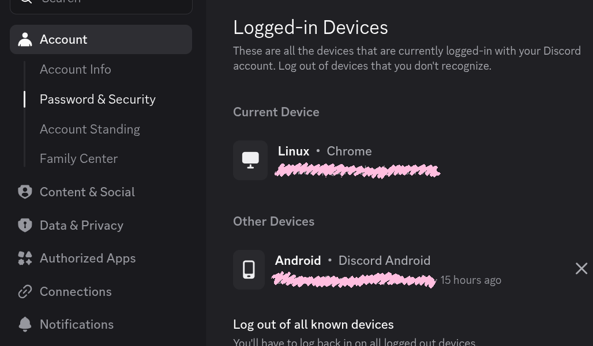
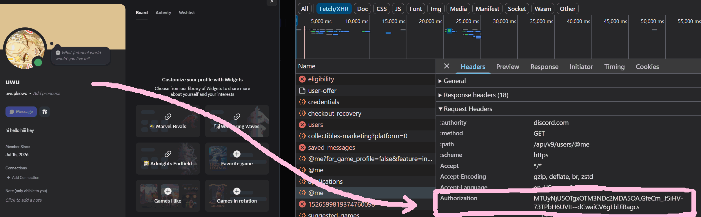
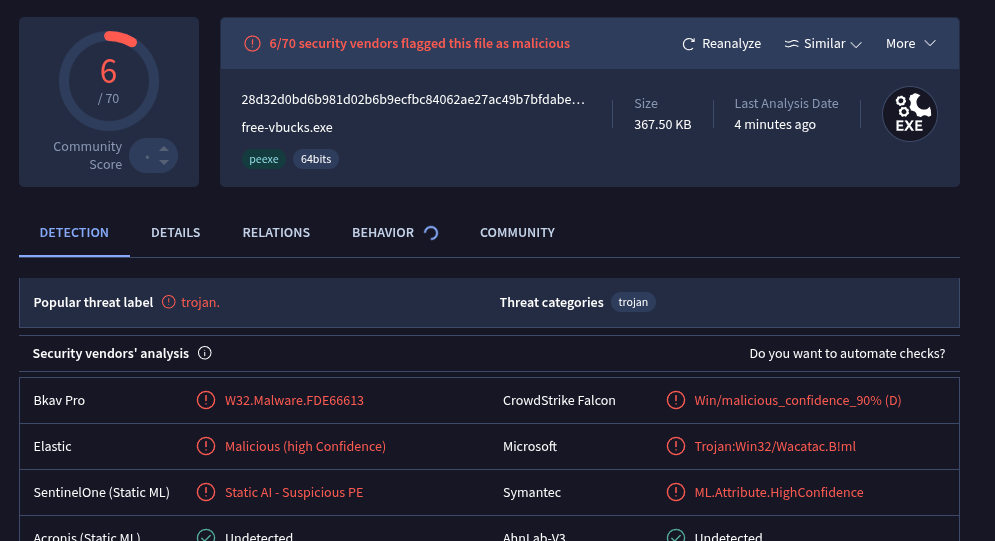
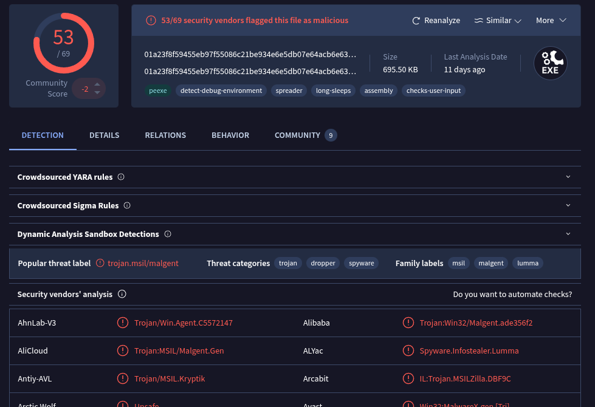
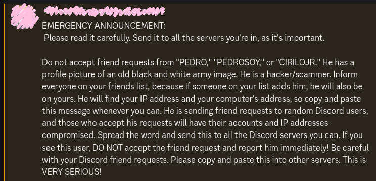

There is a whole lot of garbage on the internet about malware in the form of SEO slop "funded" by antimalware companies, with much of it ostensibly generated by AI (or LLMs if you want to be a pedant about it). Like most things produced by generative AI, I don't think these provide much in the way of tangible societal benefit; anything more technical than this seems to be either CTO-targeted SEO slop or technical reports distributed as a PDF for like CISA or whatever.

Maybe this is just selection bias, but I find there is a bit of a lack of useful and "authoritative" information within some of the online spaces I find myself frequenting (though not that I would necessarily consider myself an authority). I do believe - and this is perhaps a somewhat contentious take - that using a PC for gaming or even participating in online communities via private Discord servers is *generally* indicative of a non-trivial technical ability. Despite it all, I see a lot of mythologizing around not just the capabilities of malware, but also a little bit on what malware is trying to achieve, and I hope can kind of "shed some light" on how these things actually function (which I hope proves to be helpful and informative and whatever else you might hope to gain). 

## Infostealer dissection 

I want to start this off by emphasising that infostealers are exceptionally simple programs. So simple, in fact, that I can write a Discord session stealer in one night - which includes some basic server infrastructure for transmitting and utilizing a Discord session token.

Also, if the infostealer demonstration seems a little shoehorned, it's because I got too excited about it and I wrote the program before fully realising what I wanted to use it to illustrate - I still think it's kind of cool though.

### A quick side note on "the session"

> Feel free to [skip past this section](#okay-infostealer-demo-time) if you already understand sessions

If you are unaware of this concept, I am sure this requisite information will be pretty valuable, as sessions are not just pertinent to Discord or to infostealers. Sessions are a pretty ubiquitous concept  - in fact, you can generally assume that a website assigns a session token if it requires you to login. Anyway, I will try to keep the rest of this somewhat brief because it *is* pretty simple at its core.

Anyway, when you login to a website, you are usually assigned a "session token" (effectively a random, unique string of text) and the website associates that token with your account by storing your token with your account in a database. You usually will have individual sessions for each device and browser - on Discord, you can view a list of your sessions (which they call "Logged-in Devices") under your account settings:

Session tokens are created for sake of convenience - whenever your computer wants to retrieve or modify data that that should only accessible to *you*, this session token is attached to the request rather than continually re-prompting you for your username and password (and any applicable MFA methods). Here, you can see the Discord web client automatically adds your session token to a request for account info (information that includes, for example, your email), which the server will verify on the backend: 

This is essentially it - there are a few implementation details I've left out, but I don't really think they are important here. If you didn't know about session tokens before then it might already be kind of obvious to see how hackers are getting around MFA - if not, though: session tokens are literally a purpose-built avenue for bypassing the login process (and they need to be stored *somewhere* on your computer). 

### Okay infostealer demo time

Roleplay as an infostealer victim for a moment: you've just downloaded some random program from the description of a YouTube video promising free V-Bucks in Fortnite (as implied by `free-vbucks.exe`). 

This demo below primarily asks that you focus on the Windows virtual machine on the right-hand side, however the left side has some reference material that lets you peek behind the curtain, so to speak:
- Your friends, who receive your spam message,
- The attacker's server, which receives the session token from the malware and automatically sends the spam message.

> **NOTE**: I do not own the domain `dlscord.gg`, and you probably don't want to interact with this URL! The malware-server communication in this demo was configured on an entirely local network. 

As you can see, I don't need to come up with any kind of crazy exploit - if I can simply convince enough people to run this program, I can sell their credentials to a spammer for almost entirely passive income - and, as a former child, I can confirm that children are famously naive, have little in the way of disposable income, and *desperately* want VBucks.

I will discuss this more a little bit later, but also note that it's not necessarily the case that your token is immediately utilized for spam; the people that distribute this type of malware (known as "affiliates") are often purchasing access to malware, and have more incentive to sell the infostealer credentials as they may not have an immediate, financially-viable *reason* to utilize a token the moment it is retrieved. Additionally, I have written this using the lens of a Discord token, but infostealers are casting a wider net than this, as more credentials generally yield a higher financial output.

### Implementation details

The Discord session token for the Windows application is encrypted and stored in the `%APPDATA%\discord\Local Storage\leveldb` directory - the key for decryption is stored alongside it in the file `%APPDATA%\discord\Local State`. This is similarly true for any Chromium-based program (including Electron and Google Chrome) where the client stores session information via the `localStorage` or `IndexedDB` API - browser cookies are stored in a similar fashion too - so it's not at all difficult to extend this functionality to scrape a wider array of credentials. Aside from persistence - installing itself inconspicuously so that it can run intermittently (to check for new or updated credentials) - this is effectively all an infostealer does. 

This is not necessarily "production-grade" malware, for lack of a better term; it does one thing and it yells very loudly about it ([link to virustotal scan](https://www.virustotal.com/gui/file/28d32d0bd6b981d02b6b9ecfbc84062ae27ac49b7bfdabe721dc35eebd84a403) - though note that this scan might group with similar-smelling binaries in the near-to-distant future, so I will upload the compiled `free-vbucks.exe` somewhere  in the future):

> The `Trojan:Win32/Wacatac.B!ml` is a common Windows Defender "false positive", but if you can't fully verify the legitimacy of a file then you probably shouldn't run it. 

`free-vbucks.exe` triggers a few detections, though these are based entirely on the fact that it eminates a malware-like stench - heuristic  ["indicators of compromise"](https://www.fortinet.com/resources/cyberglossary/indicators-of-compromise#:~:text=IOCs%20act%20as%20flags%20that%20cybersecurity%20professionals%20use%20to%20detect%20unusual%20activity%20that%20is%20evidence%20of%20or%20can%20lead%20to%20a%20future%20attack.%20There%20are%20several%20different%20types%20of%20IOCs.%20Some%20include%20simple%20elements%20like%20metadata%20and%20others%20are%20more%20complex%2C%20such%20as%20complicated%20code%20of%20malicious%20content.%C2%A0) (or "IOCs") - some of which might include:
- The file's entropy (the [information theory](https://en.wikipedia.org/wiki/Entropy_(information_theory)) definition of entropy, that is - higher entropy is indicative of encrypted or obfuscated information), 
- Windows API [module and function imports](https://www.ired.team/offensive-security/defense-evasion/windows-api-hashing-in-malware#problem-for-malware-developers),
- Static strings (i.e. hard-coded, human-readable text) compiled into the executable. 
- If the binary is [signed](https://en.wikipedia.org/wiki/Code_signing), or perhaps [attested by Microsoft](https://learn.microsoft.com/en-us/windows-hardware/drivers/dashboard/code-signing-attestation)

Generally speaking, the more of these heuristic IOCs, the more likely a security solution is to flag it as probable malware.

Given that `free-vbucks.exe` does effectively nothing to conceal itself, it is *probably* flagged here because of its one and only routine - that is, an unsigned program reads in a session token, decrypts its contents, transmits that decrypted token to a server, and... effectively nothing else[^2].

For mass distributed malware, rather than flagging samples solely based on heuristic IOCs, security venders usually flag "known bad" samples based on more definitive IOCs. Some of the simplest forms here include the program's hash (which is a [mostly-unique](https://en.wikipedia.org/wiki/Hash_collision) fixed-length representation of the file's contents) and known patterns that tend to be specific to certain malware families (see: [YARA](https://virustotal.github.io/yara/) and [SIGMA](https://sigmahq.io/docs/guide/about.html) rules).

Take [this LummaStealer virustotal scan](https://www.virustotal.com/gui/file/01a23f8f59455eb97f55086c21be934e6e5db07e64acb6e63c8d358b763dab4f) for instance:

The above sample was uploaded to [vx-underground](https://vx-underground.org) on 2025/07/10 (I am unsure whether this is 10 July or 7 October); either way its not *super* recent, but I wanted to demonstrate that there are key indicators that security solutions use to both flag *possible* malware and also *definite* malware, despite not always being totally foolproof. 

## Mythology & supersition: malware is kind of about return-on-investment, actually

I think a lot of the mythologizing I see is partially based on what malware *might* be able to do, and the myths extrapolate out from that. Some of the big name families I might think of include [Stuxnet](https://en.wikipedia.org/wiki/Stuxnet), [WannaCry](https://en.wikipedia.org/wiki/WannaCry_ransomware_attack), and [(Not)Petya](https://en.wikipedia.org/wiki/2017_Ukraine_ransomware_attacks) - these all required effectively no interaction for infection to occur, and all three were are attributed to "advanced persistent threats" (APTs; specifically nation-state actors here). All three also made use of notably complex "exploit chains"; Stuxnet is directly attributed to the NSA, and most of the *legwork* for WannaCry and NotPetya was also thanks to (you won't believe this) the NSA - both made use of the [EternalBlue](https://en.wikipedia.org/wiki/EternalBlue) exploit. 

I want to try to "temper your expectations", so to speak, around the realistic capabilities of malware, because what you are likely to *actually* encounter is probably very unsophisticated for an amazing reason.

### Economic trade-offs

Consider the following points regarding the aforementioned big names in malware:

 - **Stuxnet**, while technically very sophisticated, was also designed to be deployed with a precise goal: to disrupt nuclear material production, and gather intelligence about Iranian nuclear technology (amongst some other things). It was meant to be in-place and remain undiscovered for as long as possible, and this meant drawing a minimal amount of attention to itself - so it was designed only to execute its payload on machines that matched certain criteria[^1].
 - **WannaCry** was [not really all that advanced](https://www.benthamsgaze.org/2017/05/16/paybreak-able-to-defeat-wannacrywannacryptor-ransomware/#:~:text=Wannacry%20isn%E2%80%99t%20really%20much%20different%20than%20every%20other%20ransomware%20family) at the end of the day; it was more or less "disabled" in around [24 hours](https://www.abc.net.au/news/2017-05-16/ransomware-cyberattack-marcus-hutchins-gives-interview/8530574), and a decryption tool was available within a few days. EternalBlue had been patched [3 months prior](https://www.eweek.com/security/wannacry-ransomware-attack-hits-victims-with-microsoft-smb-exploit/#:~:text=based%20on%20an%20exploit%20that%20Microsoft%20patched%20with%20its%20MS17%2D010%20advisory%20on%20March%2014) anyway, so its somewhat unlikely that *you* were really ever at risk (you wouldn't let Windows go extended periods of time without updates... r-right?).  
 - **NotPetya** was [a "wiper" wearing ransomware skin](https://en.wikipedia.org/wiki/Petya_(malware_family)#:~:text=it%20was%20equivalent%20to%20a%20wiper.) (it was *not* distributed for any kind of financial gain); the previous point on EternalBlue notwithstanding, NotPetya was clearly meant to destroy as much Ukrainian infrastructure as it could - banks, hospitals, and so on; machines that hadn't (or couldn't) be updated due to the nature of their purpose.

If we therefore consider the main driving force behind Stuxnet and EternalBlue to be the NSA (which is intrinsically an arm of the US military), understand that their 2013 funding request was for [$10.8 billion](https://www.nytimes.com/2013/08/30/us/politics/leaked-document-outlines-us-spending-on-intelligence.html#:~:text=the%20eavesdropping%20N.S.A.%2C%20which%20sought%20%2410.8%20billion) (cannot be bothered searching for more up-to-date numbers so just use this referentially), with a portion of this funding certainly allocated for exploit research and development. Because the sophisticated malware and exploits developed by APTs like the NSA are intended to be used *selectively* against "national threats", the associated investment is not necessarily financial, but is instead closer to the risk of detection and subsequent loss of a capability, and the return needs to justify this potential loss.

In contrast to the goals and virtually unlimited budget of the United States' military, infostealers need to be financially viable - exactly like a legitimate business. You may have heard of the term "malware-as-a-service", but if not, this term describes the business of selling access to code and infrastructure. 

In the Year of Our Lord 2026, the kind of malware that steals your Discord account is one of like 5 different "mass-distributed" [malware families](https://www.artresilia.com/the-infostealer-pandemic-why-every-organisation-is-vulnerable/#:~:text=of%20credential%20theft.-,Dominant%20Infostealer%20Families,-The%20threat%20is) (slight hyperbole). You can read more about MaaS [in this Huntress post](https://www.huntress.com/malware-guide/malware-as-a-service-cybercrime) if you wish, but I am going to be pretty brief - infostealer campaigns (to my understanding) usually involve steps along the lines of the following:

1. A malware developer rents out access to infostealer code and infrastructure to "Affiliates"
2. Affiliates steal credentials using this code and infrastrcture
3. Affiliates sell infostealer logs in bulk to spammers and scammers
4. Credentials are used to run scams and/or distribute more malware

To put a ballpark dollar amount on infostealer logs, it's alleged that logs sell for an average of [$10 each](https://deepstrike.io/blog/stealer-log-statistics-2025#:~:text=Underground%20Markets%20%26%20Pricing), depending on the type or quality of credentials present in a log.

### Oh my god please just get to the point

Given an infostealer is a financially-motivated endeavor, a campaign's goal is to maximize the log volume, and the most reliable way to achieve this is through social engineering human nature is more or less constant, rather than the fleeting viability of a sophisticated zero/single-click exploit. 

Returning to the $10 average for infostealer logs for a second - affiliates in upper revenue bands might expect to see *monthly* revenue figures of somewhere around $10,000. Given the $200,000 to several million you [might be able to bag](https://www.vectra.ai/topics/zero-day#:~:text=Table%3A%20Reported%20zero%2Dday%20exploit%20pricing%20by%20target%20type%20(2024%E2%80%932026).) by simply selling or disclosing the exploit itself, using these kinds of exploits to run an infostealer campaign kind of constitutes what I could only peg as an absurd waste (though the bit would be unimaginably funny, perhaps). 

So with this now in mind, I want you to momentarily turn your attention to this bit of fear-mongering (well-intentioned as it may be) so I can use it as an example:

Despite smelling a lot like one of those emails you used to get about the ghost who will come to your house at 3am tonight and remove your skin unless you forward this to 10 different people before midnight or whatever (also [your IP address](https://www.youtube.com/watch?v=jjKFXlFNR4E) is probably way less personally-identifying than you might think) - when you take a step back and look at it from a financially-motivated business perspective, this seems more or less like economic illiteracy. 

I mean okay yeah, whatever; it's pretty unlikely you would get a $200,000 payout from Discord for disclosing something like this, but your attack surface is also substantially smaller. In a case like this, it would be far more effective to target someone important (you are probably not all that important) - remember, you want to optimize for return-on-investment, and - on average - the more specific your target, the slower your exploit is patched.

Instead, I think this kind of panicking stems from the potential delay between an affiliate stealing your credentials and a spammer buying and actually utilizing your credentials (a delay that can sometimes be on the order of months) - it can seem like your credentials were stolen out of thin air, which I think leads to these kinds of moments of [apophenia](https://en.wikipedia.org/wiki/Apophenia).

**To be clear**, though: I am of the opinion that this annoucement was addressing a situation that is astronomically unlikely to actually be a real situation, particularly if you are not some kind of person of interest (and you probably aren't all that interesting). I am also of the opinion, however, that you should avoid accepting friend or message requests from people you don't know, regardless of whether it could one-shot your account.  Additionally, this isn't to say that infostealers don't utilize any exploits ever - my argument here is moreso that the kinds of exploits they're incorporating are effectively never  a nation state-level of sophistication, and its likely that there will always be some kind of social engineering tactic to get you to run some code on your computer (outside of Discord or a browser or whatever).

### What you shouldn't worry about

I don't think I'm going to get into what you should look out for, because realistically there is so much out there that I wouldn't know where to begin or what would be useful. Given that you generally need to run something in a unsandboxed environment, there is typically an upfront requirement that you need to fall for some kind of social "hook" - or believe it just enough to do something foolish, like running an `.exe`, allowing macros in a Word document, pasting a PowerShell script into a `run.exe` dialog, or any one of an infinite number of things that would be impossible for me to cover.

Instead, in line with the theme of this whole essay, I want to note some items that *almost* certainly won't result in an infection, despite the smallest of risks (however unlikely it may be) that this is finally the one that actually gets you. So while it is always better to be cautious, of course, these things probably won't cause any particular harm:
 
- **Clicking on links**[^4]: Even if something automatically downloads or copies itself onto your clipboard, you are going to be safe effectively every time - so long as you *don't actually execute anything* that downloads or copied out of the browser environment.
- **Opening images**[^5]: Though something like [FORCEDENTRY](https://en.wikipedia.org/wiki/FORCEDENTRY) was a real zero-day exploit, it was also a nation state-tier capability and was deployed against nation state-tier targets[^6]. Additionally, even if an image [contains a malware payload](https://unit42.paloaltonetworks.com/malicious-payloads-as-bitmap-resources-hide-net-malware/), this doesn't automatically make it executable when opened via an image viewer or browser, for example - this is usually just a tricky way of sneaking code past security solutions, and usually has to be transformed by a script or executable to reconstruct the malicious payload.

To expand on this slightly, modern browsers (Firefox, anything Chromium-based, Safari, ...) are intended to be an isolated environment, and code running in your browser is "sandboxed" such that malware can't directly infect your computer from a browser window. In fact, each tab is meant to be isolated from all other tabs, which is part of the reason why the browsers of today are as resource-hungry as they are. 

One caveat (amongst many other caveats that I'm not going to address) is that this isolation is **not necessarily the case for browser extensions!** I won't elaborate, but it is perhaps worth assuming that an extension has the capability to do whatever it wants for the sake of simplicity - if you are someone who installs extensions with minimal discernment, you should stop that. Genuinely - it is really bad.

## In summary

To wrap all of this up, there isn't really a totally foolproof way to avoid "getting hacked". It's kind of like driving a car, I guess - you can't just walk everywhere, but there's always a risk that you crash and die. Precautions like seatbelts, airbags, speed limits, and whatever else are attempting to *reduce* that risk as much as possible, but they don't totally eliminate it. It's generally a good rule of thumb to simply avoid opening files from a source you don't completely trust - this isn't always an exact science either, however, as terms like "open", "file", and "(un)trusted source" tend to have pretty broad and fluctuating definitions, and sometimes things slip through the cracks at a bad time.

In terms of security solutions, Windows Defender is probably one of the better Microsoft products these days; unless you have a specific reason to pay for AV, Defender is more or less on-par with anything you would pay for. I can't really comment on it's *performance* footprint, but it's not making a noticable difference to your gaming experience.

I had thoughts on whether or not to show the source code for `free-vbucks.exe`, but I don't think I will - it's not like this is all that hard to make, but its even easier to get a VPS and swap out some URLs and do actual harm.

Ultimately, this isn't legal advice or whatever. I'm kind of relying on you, the reader, to be a little bit discerning hereafter; despite some of the things herein perhaps carrying the implication of "WannaCry isn't real, WannaCry can't hurt you", this is only *kind* of the case; you should probably continue to trust your gut, and if you get a weird vibe from something, it's always infinitely safer to simply not engage with it than weigh the risk against the benefit.

What was the point of all of this, then? I dyunno :3

## References

<citation>

ABC News 2017, _‘Just doing my bit’: The 22yo who blocked the WannaCry cyberattack_, _www.abc.net.au_, 16 May, Australian Broadcasting Corporation, viewed 22 July 2026, <https://www.abc.net.au/news/2017-05-16/ransomware-cyberattack-marcus-hutchins-gives-interview/8530574>.

Baranauskas, M 2023, _Windows API hashing in malware_, Ired.team, viewed 20 July 2026, <https://www.ired.team/offensive-security/defense-evasion/windows-api-hashing-in-malware#problem-for-malware-developers>.

Carrilho, M 2026, _The Infostealer Pandemic: Why Every Organisation Is Vulnerable_, Art Resilia, viewed 26 July 2026, <https://www.artresilia.com/the-infostealer-pandemic-why-every-organisation-is-vulnerable>.

Danielson, L 2026, _Malware-as-a-Service (MaaS): The Rise of Cybercrime as a Business Model_, Huntress, viewed 22 July 2026, <https://www.huntress.com/malware-guide/malware-as-a-service-cybercrime>.

fasterthanlime (dir.) 2024, _POV: I’m on my third coffee and you just asked me how the internet works_, _YouTube_, viewed 21 July 2026, <https://www.youtube.com/watch?v=jjkfxlfnr4e>.

Kerner, SM 2017, _WannaCry ransomware attack hits victims with Microsoft SMB exploit_, _eWEEK_, 12 May, viewed 20 July 2026, <https://www.eweek.com/security/wannacry-ransomware-attack-hits-victims-with-microsoft-smb-exploit/>.

Khalil, M 2025, _Stealer log statistics 2025: the rise of credential theft at scale_, DeepStrike, viewed 22 July 2026, <https://deepstrike.io/blog/stealer-log-statistics-2025>.

Kolo, E 2017, _PayBreak able to defeat WannaCry/WannaCryptor ransomware – bentham’s gaze_, Benthamsgaze.org, viewed 21 July 2026, <https://www.benthamsgaze.org/2017/05/16/paybreak-able-to-defeat-wannacrywannacryptor-ransomware>.

Matrosov, A, Rodionov, E, Harley, D & Malcho, J n.d., _Stuxnet Under the Microscope_, _ESET Cybersecurity_, ESET Cybersecurity, pp. 5–10, 24–44, viewed 16 July 2026, <https://web-assets.esetstatic.com/wls/en/papers/white-papers/Stuxnet_Under_the_Microscope.pdf>.

Microsoft 2026, _Attestation sign windows drivers_, Microsoft Learn, viewed 24 July 2026, <https://learn.microsoft.com/en-us/windows-hardware/drivers/dashboard/code-signing-attestation>.

Shane, S 2013, ‘New leaked document outlines U.S. spending on intelligence agencies’, _The New York Times_, 29 August, viewed 22 July 2026, <https://www.nytimes.com/2013/08/30/us/politics/leaked-document-outlines-us-spending-on-intelligence.html>.

Wikipedia 2019a, _Entropy (information theory)_, _Wikipedia_, 2 April, Wikimedia Foundation, viewed 21 July 2026, <https://en.wikipedia.org/wiki/Entropy_(information_theory)>.

― 2019b, _EternalBlue_, _Wikipedia_, 8 November, Wikimedia Foundation, viewed 20 July 2026, <https://en.wikipedia.org/wiki/EternalBlue>.

― 2019c, _Stuxnet_, _Wikipedia_, 5 April, Wikimedia Foundation, viewed 20 July 2026, <https://en.wikipedia.org/wiki/Stuxnet>.

― 2019d, _WannaCry ransomware attack_, _Wikipedia_, 6 May, Wikimedia Foundation, viewed 20 July 2026, <https://en.wikipedia.org/wiki/WannaCry_ransomware_attack>.

― 2022, _2017 Ukraine ransomware attacks_, _Wikipedia_, 21 September, viewed 20 July 2026, <https://en.wikipedia.org/wiki/2017_Ukraine_ransomware_attacks>.

― 2023, _Petya (malware family)_, _Wikipedia_, 4 September, Wikimedia Foundation, viewed 22 July 2026, <https://en.wikipedia.org/wiki/Petya_(malware_family)>.

</citation>

[^1]: Stuxnet targeted "sites using SCADA systems [despite] promiscuous dissemination" (Matrosov et al., p.9). In other words, Stuxnet would actively spread to every system it could reach, but would only activate if it found Siemens SCADA systems running on the machine.
[^2]: Some suspicious indicators that might trigger detections include: suspicious strings (e.g. the typosquatted URL `dlscord.gg`, paths to session token information like `%APPDATA%\discord\Local State` and `%APPDATA%\discord\Local Storage\leveldb`), as well as Windows API functions for decryption and data transmission.
[^3]: [CheatEngine](https://www.cheatengine.org) is an incredibly powerful and legitimate tool (in the sense that it isn't malware) - the free installer *does* bundle in a bit of junkware if you simply spam "next", though. Otherwise I would err on the side of "its probably malware" - cheat developers who distribute their cheats - much like malware developers - are often in it for the money.
[^4]: This *could* leak your IP, though this is not necessarily deanonymizing on its own. Regarding DDOS attacks, If you are behind an IPV4 address using CGNAT, "your" public IP is a shared connection and incoming packets cannot be routed back to you; if you're assigned a V6 IP, NAT isn't required (so you don't have the same inherent protections), but mitigations at the ISP level (e.g. BGP Flowspec) are much more proliferant and advanced today than they were even just 5 years ago.  
[^5]: Depending on what you use to open the image - sometimes an application is exploitable, but it's no longer maintained so the vulnerability never gets fixed. Google Chrome, Discord, the Windows photo viewer program, and others, however, are not in this class of application (make sure you update regularly, though...).
[^6]: I use the term "nation state-tier target" to refer to the specificity of the targets that FORCEDENTRY was used against; this isn't to say that I think NSO Group isn't effectively a criminal organisation for [targeting journalists and activists](https://www.theguardian.com/technology/2021/sep/13/nso-group-iphones-apple-devices-hack-patch), however.

